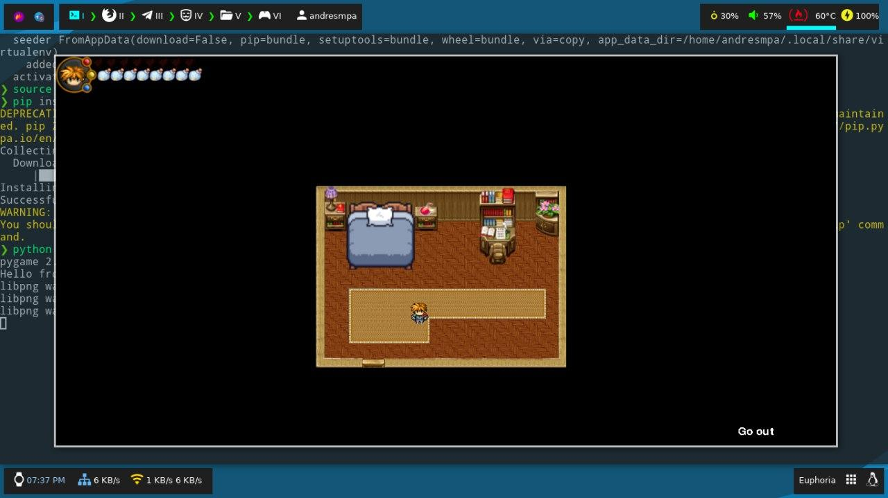

# Euphoria

## Summary

Is an RPG & combat by turns game created for one subject at
my university, so there's no too much to say; I was made in
python 2.7 using pygame, so if you want to run it you'll
need use that, check the some images from the game:

## How to use

This game is running in pygame, so you need to use python 2
the recommended way is to use [virtualenv](https://pypi.org/project/virtualenv/)
just as the following example:

`$ ./install.sh`

Note: This may not work on windows, if you are running in on windows you have to install it manually
